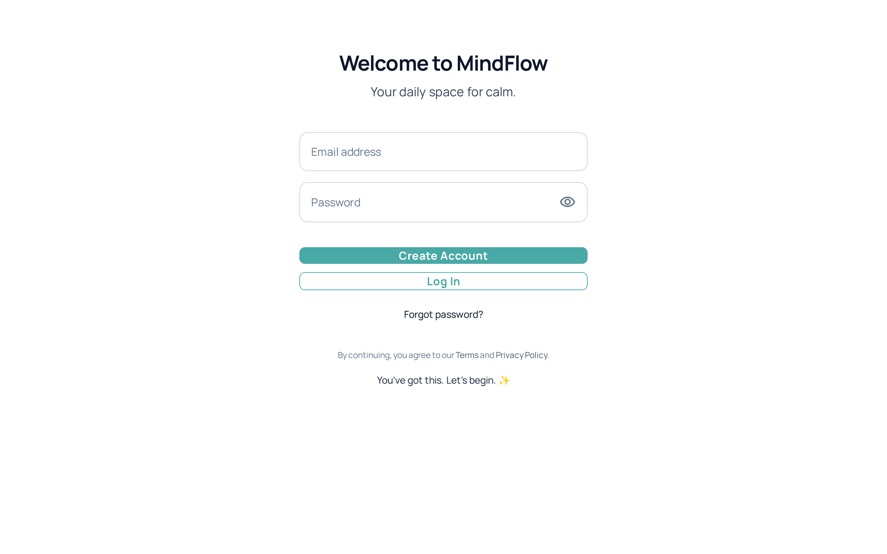
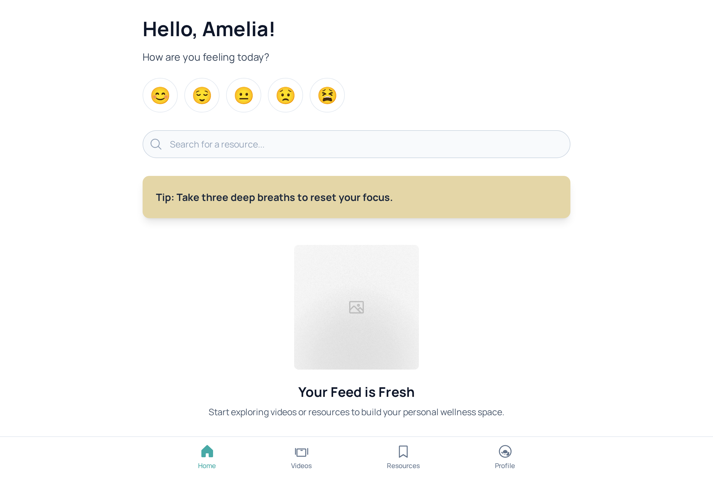
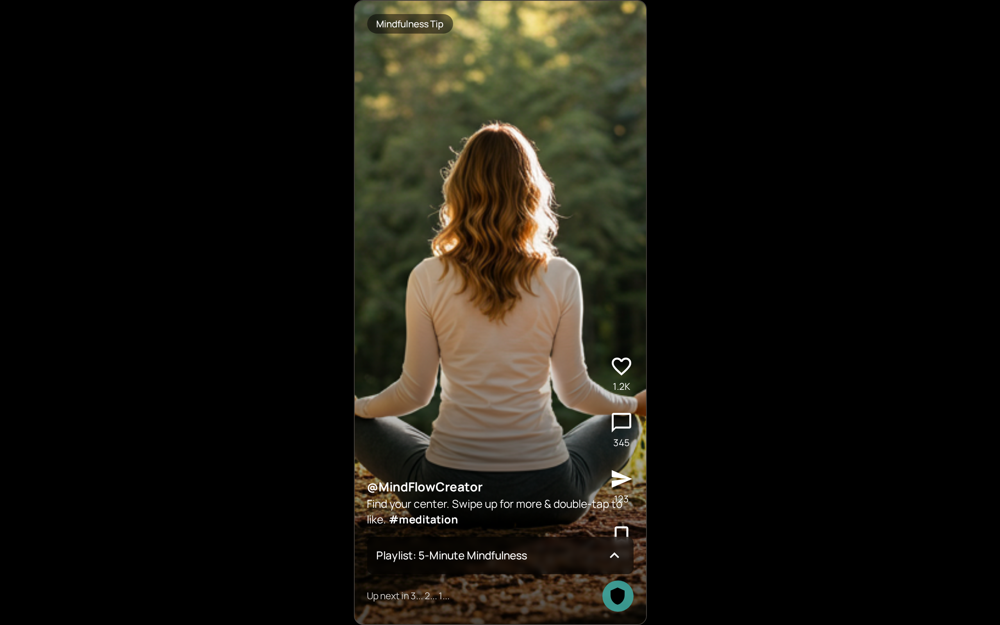
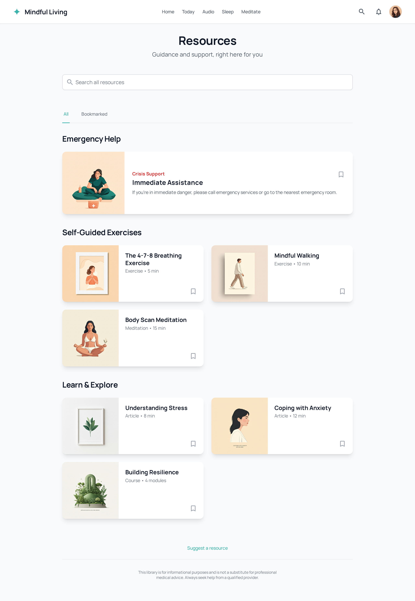

# Site Mock Ups

This section provides visual mock ups of key screens in the application, illustrating layout and major UI elements.

## Login Screen
A simple login form where users can sign in using their credentials. The screen typically includes:

- App logo or title
- Email and password input fields
- Sign In button
- Option for password reset or sign up

## Home Screen
The main landing page after login, showing:

- Header with site title and user avatar
- Infinite-scroll video feed (VideoFeed)
- Navigation or sidebar (if present)

## Video Component
A detailed view of a single video card, including:

- Video player (play/pause controls)
- Like button
- Share button
- Option to open the Resource Page for more help

## Resource Page
A page listing professional help resources, featuring:

- List of resource cards (title, description, link)
- Topic-based navigation (e.g., anxiety, depression)
- Clean, accessible layout for easy browsing 