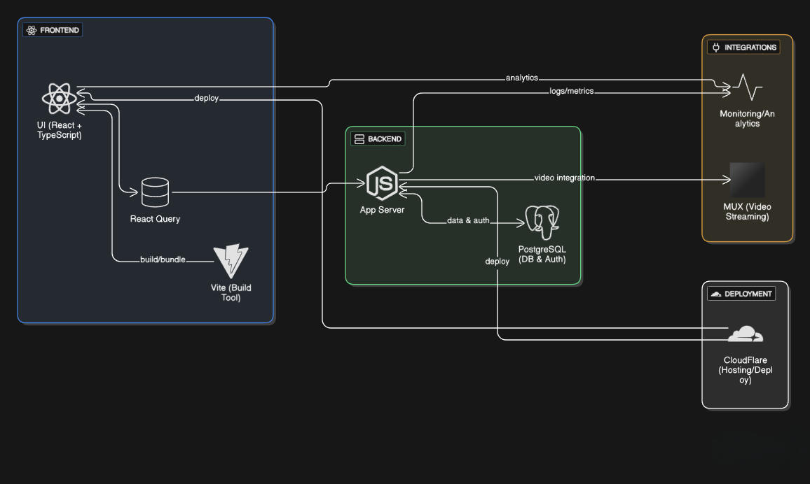

# System Block Diagram

This diagram illustrates the architecture of the system, showing how different components interact with each other. It includes the following key elements:

- **Frontend**: Built with React, TypeScript, Vite, and react-query. Handles the user interface and communicates with the backend for data fetching and authentication.
- **Backend**: Node.js API written in TypeScript. Manages authentication logic, business rules, and serves as the main point of integration for other services.
- **Database**: PostgreSQL stores user data, journal entries, and preferences securely.
- **Video Stream**: Utilizes Mux for secure video streaming and playback, providing a robust video player experience within the application.
- **Integrations**: Includes Email/Notification services, Analytics/Monitoring, and 3rd Party APIs for extended features and event tracking.
- **Deployment**: Separate deployment pipelines for backend and frontend, managed with environment variables and configuration secrets.

Each component is connected as shown in the diagram, ensuring secure, scalable, and maintainable system architecture.
