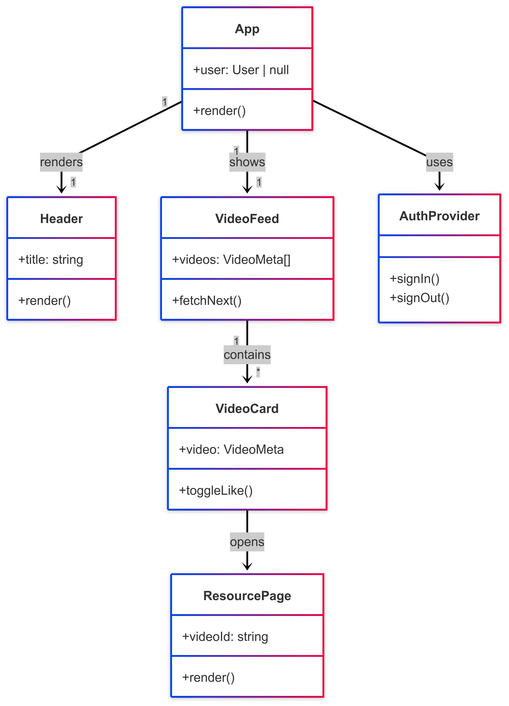
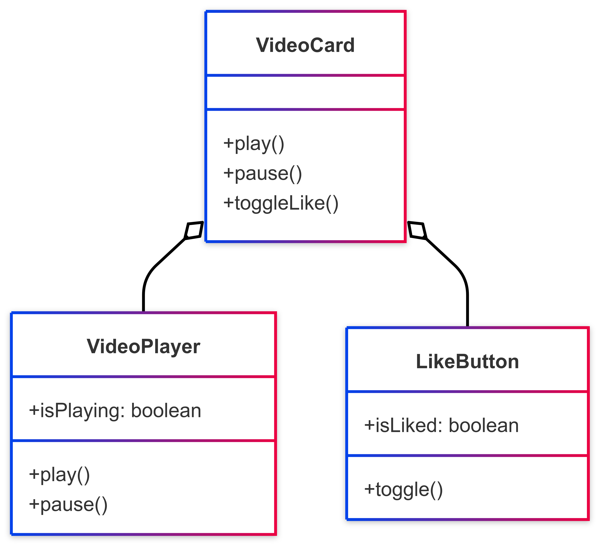
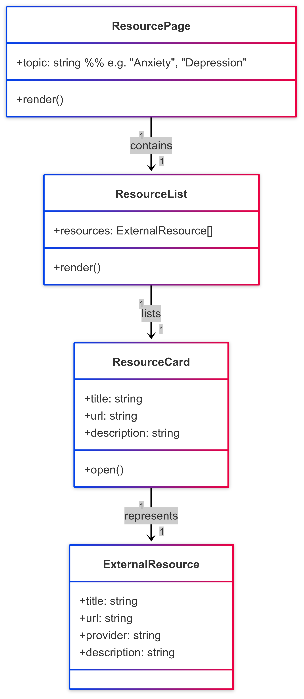

# Class Diagrams

This section provides an overview of the class diagrams used in the system architecture. Diagrams illustrate key classes, their properties, methods, and relationships.

## Front-End Class Diagram — Quick Overview

This diagram shows the high-level skeleton of the React application:

- **App** is the root component. It renders shared chrome (e.g., Header) and the main feature area (VideoFeed).

- **Header** is a purely presentational component that shows the site title, user avatar, etc.

- **VideoFeed** owns the infinite-scroll timeline. It fetches paged video metadata via react-query and renders a list of VideoCard instances.

- **VideoCard** is the atomic UI unit for playback and engagement (like, share, etc.). Clicking a card can open the Resource Page for deeper help.

- **AuthProvider** centralises Supabase auth; any component can call its signIn / signOut.

Arrows convey runtime composition, e.g., "App → VideoFeed" means the feed appears inside the App tree, while "VideoFeed → * VideoCard" shows many cards per feed.

This keeps the top-level view to five or six boxes—clear enough to grasp in seconds.

## Video Component Internals — Quick Overview

Here we zoom into how a single VideoCard works:

- **VideoCard** orchestrates everything: it holds the current video prop and exposes interaction handlers (play, pause, toggleLike).

- **VideoPlayer** wraps the HTML5 `<video>` element (or a library player) and provides imperative controls (play, pause).

- **LikeButton** handles optimistic likes via a react-query mutation.

## Resource Page Diagram — Quick Overview

This diagram models the page that surfaces professional help links instead of videos:

- **ResourcePage** is routed by topic (e.g., "/resources/anxiety"). It loads a ResourceList and hands it ready-to-render data.

- **ResourceList** maps over an array of ExternalResource objects, producing one ResourceCard per item.

- **ResourceCard** is a small tile that shows title, short description, and an outbound link (open()).

- **ExternalResource** is a light domain object or TypeScript interface capturing metadata for each help link (provider name, URL, description).

