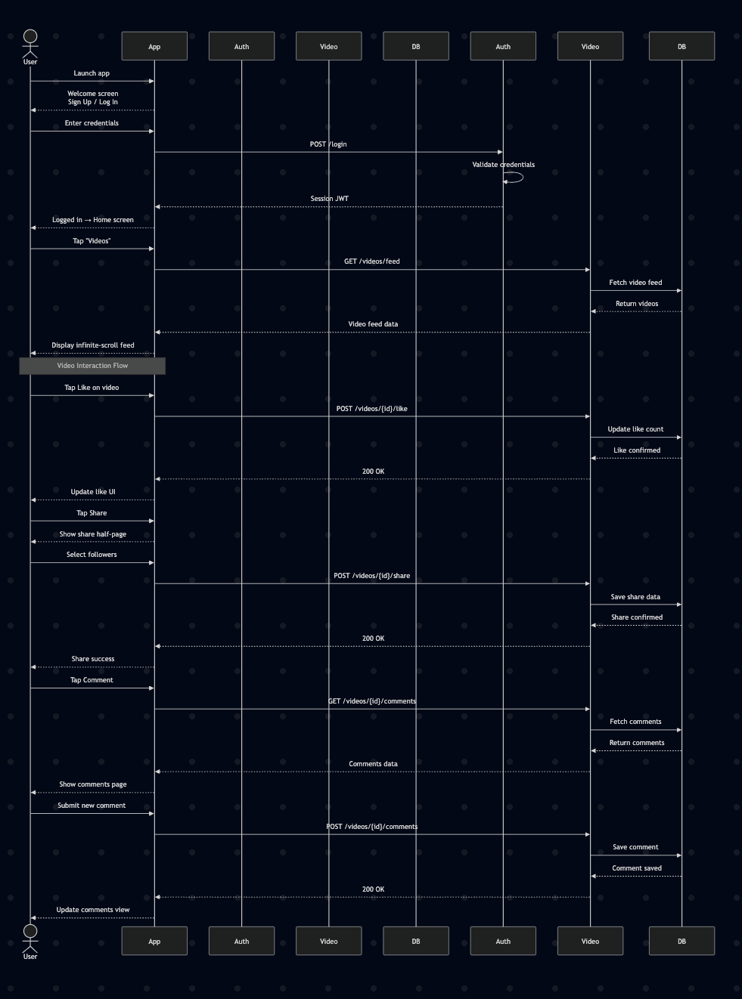

# Sequence Diagrams

This section provides sequence diagrams that illustrate the flow of interactions between different components and services in the mental health literacy application.

## Use Case 1 – Account Creation

## Use Case 6 – Video Interaction
