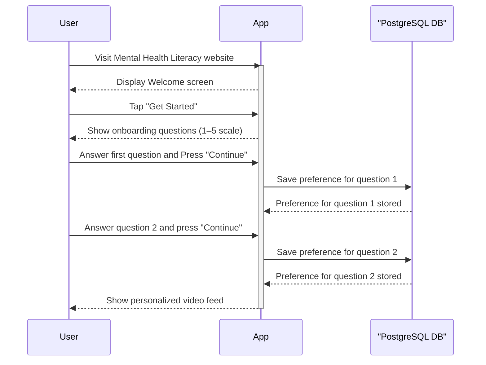
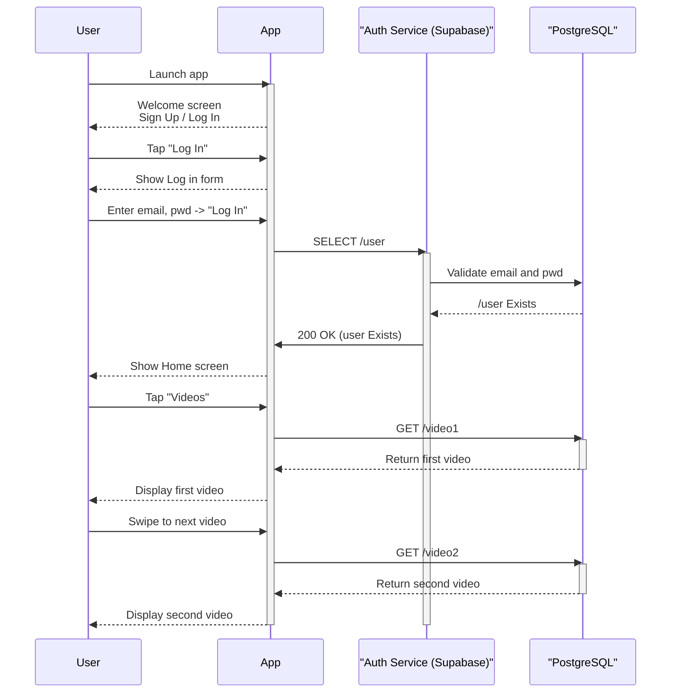
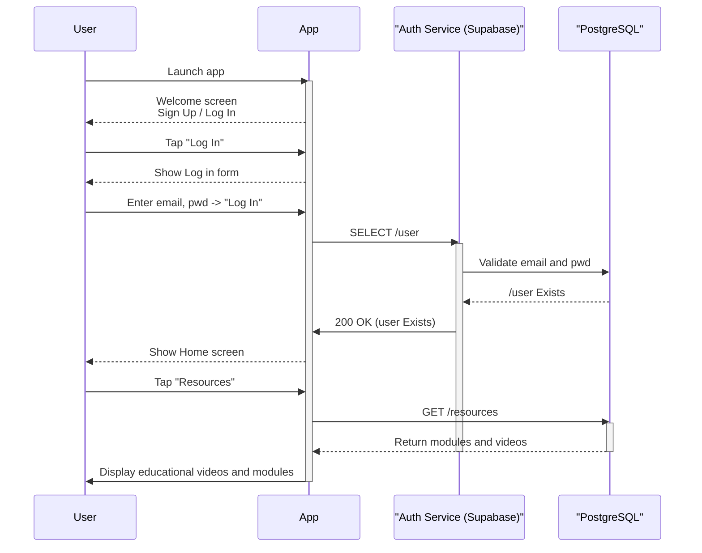
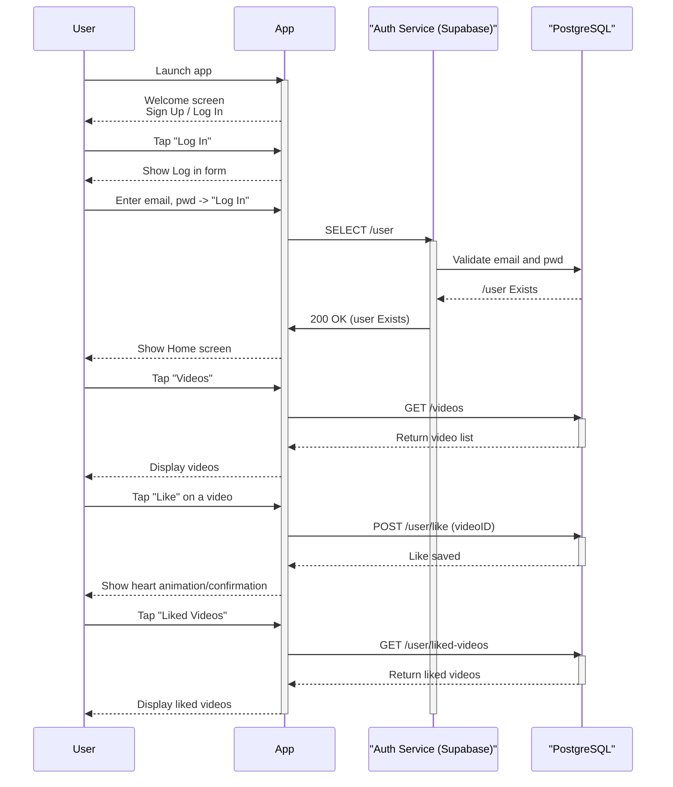

# Sequence Diagrams

This section provides sequence diagrams that illustrate the flow of interactions between different components and services in the mental health literacy application.

## Use Case 1 – Account Creation

## Use Case 2 - Onboarding to the Application

## Use Case 3 - Videos 

## Use Case 4 - Educational Resources 

## Use Case 5 - Liking Videos

