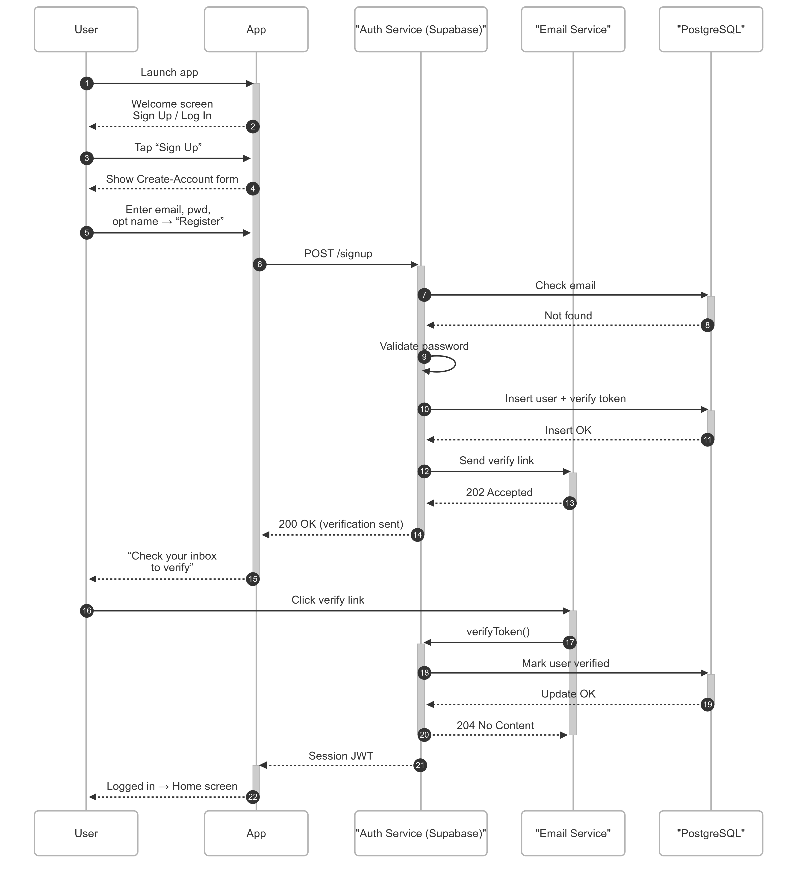
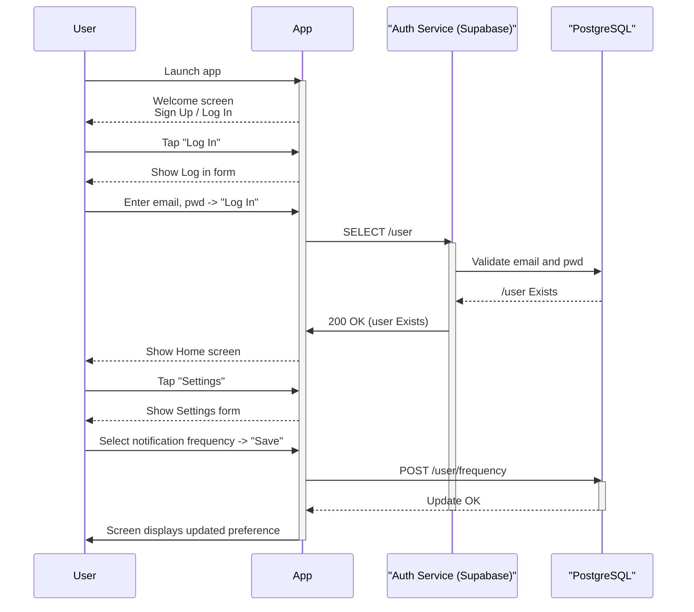
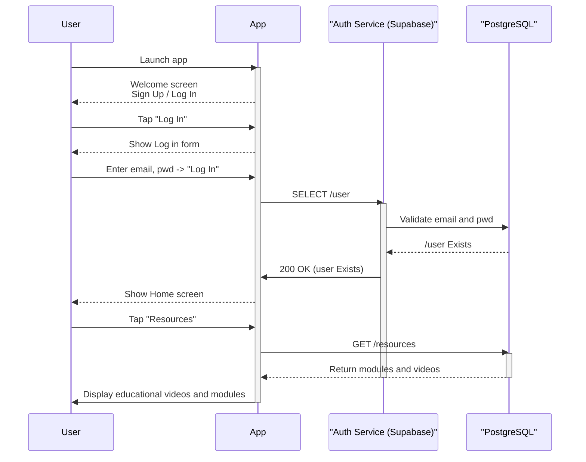
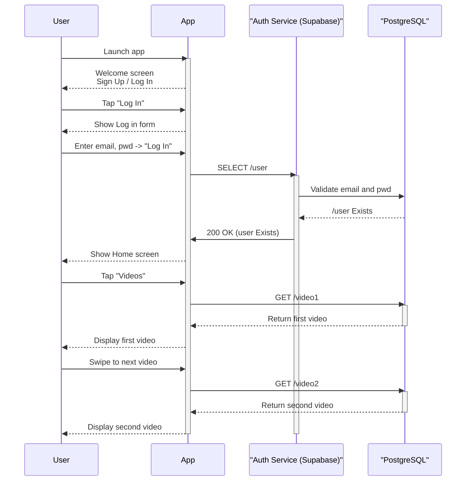

# Sequence Diagrams

This section provides sequence diagrams that illustrate the flow of interactions between different components and services in the mental health literacy application.

## Use Case 1 – Account Creation

## Use Case 3 - Preferences

## Use Case 4 - Educational Resources 

## Use Case 5 - Videos 

